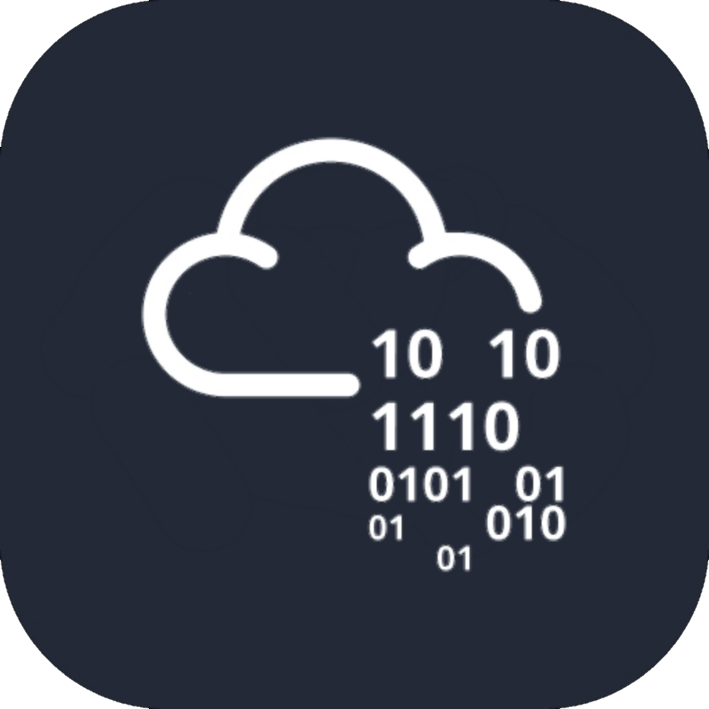

<p align="center">
    
    
</p>

<h1 align="center"> Write-ups HackTheBox & TryHackMe </h1>

> Repositório com write-ups de máquinas resolvidas no HackTheBox e TryHackMe, como parte da minha trilha de estudos em segurança ofensiva.

</br>

<h2 align="center"> Conecte-se Comigo </h2>

<p align="center"><a href="https://linkedin.com/in/kelly-f-m"></a>&nbsp;<a href="https://github.com/kelly-f-m"></a>&nbsp;<a href="https://app.hackthebox.com/public/users/3757032"></a>&nbsp;<a href="https://tryhackme.com/p/iswia"></a></p>

</br>

## Índice de Máquinas

</br>

### Hack The Box
| Máquina | Dificuldade | OS | Técnicas | Write-up |
|---|---|---|---|---|
| Lame | Fácil | Linux | Samba RCE (CVE-2007-2447) | [Link](machines/lame/writeup.md) |
| Forest | Médio | Windows | Kerberoasting, AD enum | [Link](machines/forest/writeup.md) |

</br>

### TryHackMe
| Sala | Dificuldade | OS | Técnicas | Write-up |
|---|---|---|---|---|
| ... | ... | ... | ... | ... |

</br>

## Progresso e Certificações
- [ ] [Jr Penetration Tester](https://tryhackme.com/path/outline/jrpenetrationtester) — em andamento
- [ ] [eJPT](https://ine.com/security/certifications/ejpt-certification) — planejado
- [ ] [OSCP](https://www.offsec.com/courses/pen-200/) — planejado
- Plataformas ativas: TryHackMe, HackTheBox, PortSwigger Web Security Academy

</br>

## Estrutura do Repositório

```
├── README.md
├── images/
└── machines/
    └── nome-da-maquina/
        ├── writeup.md
        └── images/
```

Cada write-up segue uma estrutura padrão: Reconhecimento → Enumeração → Exploração → Escalação de Privilégio → Flags → Lições Aprendidas → Mitigação

</br>

## Aviso
Todo conteúdo aqui é publicado apenas após liberação oficial da plataforma (retired machines no HTB, salas sem restrição de spoiler no THM). Nenhuma flag real é exibida.
